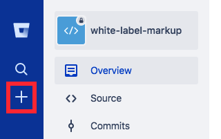
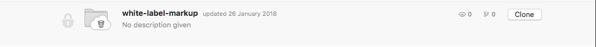
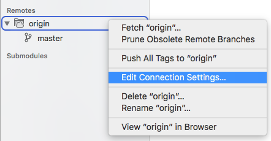
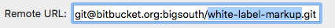

# Base project for markup (*no neat/bourbon*)

## First time using this repository?
- If you do not have Node installed already, you can get it by downloading the package installer from [Node's website](https://nodejs.org/en/).

- Then install Gulp globally:
```
$ sudo npm install gulp -g
```

- Locate yourself into the _sites_ folder and clone the repository (not needed if you are using Tower)
```
$ git clone git@bitbucket.org:bigsouth/white-label-markup-kodexe.git
```


## Creating a new project

### With Tower

- Create a new repository in [Bitbucket](https://bitbucket.org/). Preferably **without** a .gitignore or readme.md, to avoid conflicts.



- Start Tower and clone the white-label-markup-kodexe repository to a new folder



- Enter the repository and right click the remote origin and select **Edit connection settings...**



- Change the last part of the remote URL to the created repository in Bitbucket and click 'Change'



- Edit the name in _package.json_ and update the _readme.md_ in your favorite code editor and commit your changes

- Commit the changes and then push everything to the new repository.

- Place yourself into the new repository and run the following to install all dependencies:
```
$ npm install
```

- Start the engine:
```
$ npm start
```


### The automated way

- Create a new repository in [Bitbucket](https://bitbucket.org/)

- Locate yourself into the white-label-markup-kodexe folder (_sites/white-label-markup-kodexe_) and **pull** the latest changes on the master.

- Run the `create_project.sh` script and enter the created repository's name. The name is found at the end of the bitbucket url.

https://bitbucket.org/bigsouth/**white-label-markup-kodexe**

```
$ ./create_project.sh
```

- Locate yourself into the new folder
```
$ cd ../<repository name>
```

- Change the project name in the package.json file

- You are now ready to go! Start the server
```
$ npm start
```

### Do it yourself

- Create a new repository in [Bitbucket](https://bitbucket.org/)

- Locate yourself into the _sites_ folder on your computer and clone the git repo to a wanted folder `<folder name>`:
```
$ git clone git@bitbucket.org:bigsouth/white-label-markup-kodexe.git <folder name>
```

- Enter the folder
```
$ cd <folder-name>
```

- Pull the latest changes:
```
$ git pull
```

- Change the remote to your created repository `<repository>`
```
$ git remote set-url origin git@bitbucket.org:bigsouth/<repository>.git
```

- Update the repository:
```
$ git push -f origin master
```

- Checkout a new feature branch `<branch name>`
```
$ git checkout -b feature/<branch name>
```

- Install all dependencies:
```
$ npm install
```

- Start the engine:
```
$ npm start
```

# Tips

#### Creating a clean build
Run the following to build a clean version of the project:
```
$ npm run build:clean
```
The output is found in _build/_


#### Creating a clean build with critical css for all files
```
$ npm run build:all-critical
```
The output is found in _build/_ and the generated critical css in _crititcalCSS/_


#### Deploy the build to _/clients_
Deploy a build to a sub directory on bigsouth.se:
```
$ npm run deploy
```


#### Including templates
Use `<include>`-tags to include other templates in the current template. The following example will include all the content found the template _tabs.html_:
```html
<include src="tabs.html"></include>
```


#### Using template variables
Using the following templates:
_index.html_:
```html
<include src="filename.html" label="Lorem ipsum dolor sit amet">
	<input type="text" />
</include>
```
_filename.html_:
```html
<label>@@label: @@content</label>
```
results in:
```html
<label>Lorem ipsum dolor sit amet: <input type="text" /></label>
```
